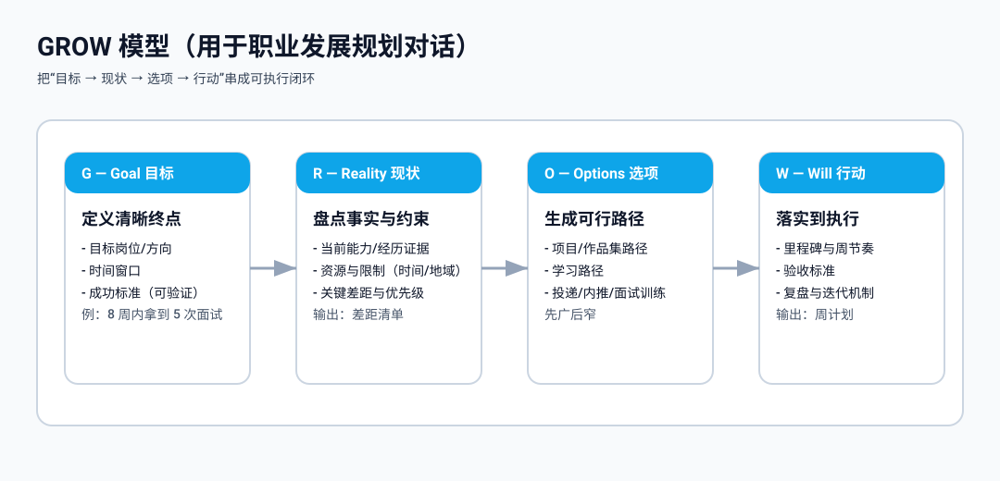

## Concept

### car 的定位

`car` 是一个面向个人职业发展的工作流：

- 用结构化输入描述“我是谁、做过什么、想去哪里、有什么约束”
- 用结构化输出沉淀“差距是什么、优先级是什么、怎么做、做到什么程度”
- 用可执行计划把分析落地为每周动作与里程碑

### GROW 模型

GROW 是一种常用的教练式对话结构，可用于把“想法”转化为“可执行行动”：

- G（Goal）：定义清晰目标与成功标准，明确时间窗口
- R（Reality）：盘点现状与约束，用事实刻画差距
- O（Options）：生成多种可行路径与方案，先广后窄
- W（Will）：筛选高杠杆选项，落实为里程碑与每周行动，并持续复盘迭代

下面给出 GROW 四个字母的“详细操作步骤”（可以直接照着做）。

#### G（Goal）：把目标写到可执行

1. 写一句话目标（不超过 20 字）
   - 格式：在【时间窗口】内，达成【岗位/行业/地点】的【结果】。
2. 约束边界（必须写清）
   - 地点/工作方式边界：例如“只考虑上海/远程”“可接受日本东京”
   - 薪资边界：例如“最低 30k×14 / 60w+”
3. 成功标准（必须量化）
   - 面试类：投递/面试/offer 数
   - 能力类：完成 2-3 个可展示项目、通过某证书/考试
   - 结果类：入职/转正/试用期目标
4. SMART 自检（逐项回答“是/否”）
   - S：具体吗？（岗位、行业、地点、方向清晰）
   - M：可衡量吗？（指标/次数/金额/百分比）
   - A：可达成吗？（资源、时间、投入匹配）
   - R：相关吗？（目标与个人优势/履历一致）
   - T：有时限吗？（明确日期/周数/月数）
5. 可行性分析（“跳一跳够得着”）
   - 定义：不是“轻松完成”，而是在合理投入下可达成；也不是“遥不可及”，需要能拆解出可验证的阶段成果。
   - 检查点：
     - 资源：每周可投入时间、预算、可用人脉/内推渠道、可获得的训练机会
     - 风险：最大风险是什么（签证/地域/家庭/健康/现金流/社保），失败成本是否可控
     - 证据链：每一步能产出什么证据（作品、证书、面试反馈、offer）
     - 时间：拆到月/周后是否仍然成立（是否挤不进日程）
6. 区分长期目标与短期目标
   - 长期目标：1-3 年（例如“去日本发展、进入某行业并在某能力树上形成壁垒”）
   - 短期目标：3-6 个月（例如“拿到目标岗位 offer”“完成 2 个可展示项目并完成 20 次模拟面试”）
   - 写法：长期目标不一定立刻可量化，但必须能落到短期目标；短期目标必须可量化、可验证。

#### R（Reality）：用事实刻画现状

1. 现状盘点（事实，不写愿望）
   - 经验：做过哪些项目/负责什么/结果是什么
   - 技能：会什么/熟练度/证据（项目、作品、证书）
   - 资源：每周可投入时间、可支配预算、社交资源
2. 信息质量要求（客观、完整、可核验）
   - 客观：用事实与结果说话，避免“我觉得/我应该”，尽量写“做了什么/做到什么程度/产生什么结果”
   - 完整：关键信息不缺失（时间、地点、角色、范围、结果、证据），避免只写标题不写内容
   - 可核验：尽量补证据（链接、作品、可公开的证明、数据指标、第三方背书）
3. 约束盘点（写“不能做什么”和“代价是什么”）
   - 地域、作息、家庭责任、风险承受、社保/户籍/签证等
4. 外部环境分析（决定“目标是否值得”与“路径是否可行”）
   - 行业周期：增长/收缩、岗位供需、薪资/职级结构变化
   - 地域因素：汇率、语言要求、签证与合规、生活成本与家庭支持
   - 机会结构：目标公司/岗位的招聘节奏、关键门槛（证书/语言/背景）
   - 结论：外部环境不等于借口，但决定了需要补的“门槛”和“缓冲计划”
5. 关键差距拆解（按领域拆）
   - 领域示例：技能、项目与作品、履历可信度、行业知识、面试表达、语言能力、家庭与保障
6. 现状结论（一句话）
   - 格式：当前最主要瓶颈是【X】，其次是【Y】。

#### O（Options）：先广后窄列出可行选项

1. 先发散（至少写 8 个选项，不评判）
   - 示例：做作品集项目、补齐核心技术栈、找内推、优化简历叙事、模拟面试、考证、转到相关岗位过渡、换城市、先拿远程/外包过渡等
2. 每个选项写“三要素”
   - 成本：时间/金钱/精力/机会成本
   - 产出：能产生什么证据（作品、数据、面试机会）
   - 风险：失败方式是什么（不可持续、不可验证、不可迁移）
3. 收敛筛选（优先选 3 个）
   - 标准：高杠杆（对面试/offer 直接增益）、可验证（能量化）、可持续（能坚持）

#### W（Will）：承诺与落地（从“选项”变“行动”）

1. 选择 1-3 个主线（明确优先级）
2. 写里程碑（按周/按月）
   - 里程碑格式：在【日期】前完成【产出物】并达到【验收标准】
3. 写每周节奏（固定时间块）
   - 示例：每周 3 次技术学习 + 2 次项目推进 + 2 次面试训练
4. 写第一周任务（必须可在 7 天内完成）
   - 每项任务写清：开始条件、产出物、验收标准
5. 复盘机制（每周一次）
   - 复盘 3 问：本周做了什么？有什么证据？下周调整什么？

### 输入与输出

- 输入（`work/inputs/`）
  - `profile.json`：基础信息与偏好
  - `experience.json`：经历与成果证据
  - `goals.json`：目标岗位/行业/时间窗口
  - `constraints.json`：时间、地域、风险、家庭等约束
- 输出（`work/outputs/`）
  - `analysis.json`：目标画像、差距、定位、策略、风险
  - `plan.json`：里程碑、周节奏、项目清单、学习路径、面试训练

### work 目录

`work/` 用于存放可提交到 git 的过程与结论：

- 可复用：换目标岗位时可以复用历史输入与产物
- 可迭代：每周滚动更新，持续沉淀可执行策略
- 可协作：不同设备/不同阶段都能基于同一套结构继续推进
