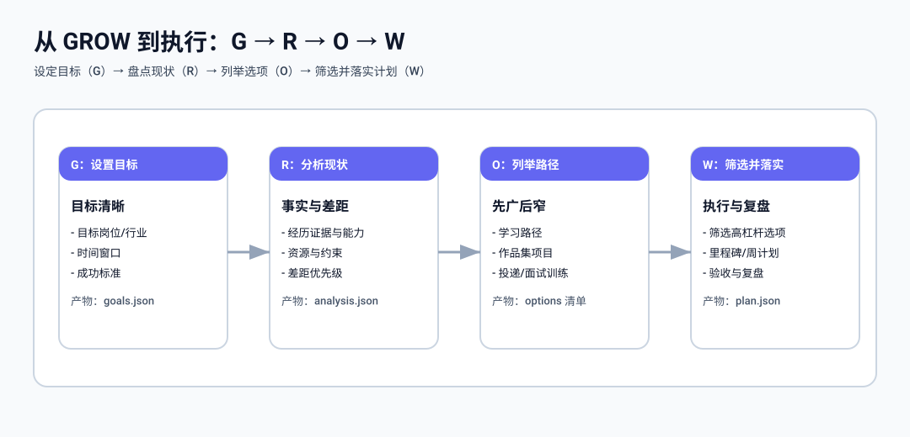

## Workflow

### 工作区与产物目录

建议将所有运行产物放到 `work/`，便于提交到 git，同时避免污染仓库根目录：

- `work/inputs/`：采集到的结构化输入（JSON）
- `work/outputs/`：分析与规划输出（JSON）
- `work/artifacts/`：中间成果物（例如能力清单、JD 摘要、面试题库、作品集草稿等）

### 推荐流程

1. 初始化：运行 `/car:init` 创建 `work/` 目录结构与 JSON 骨架
2. 采集：运行 `/car:start` 打开前端界面，录入信息并保存到 `work/inputs/`
3. 分析：运行 `/car:analyze` 产出 `work/outputs/analysis.json`
4. 规划：运行 `/car:plan` 产出 `work/outputs/plan.json`
5. 迭代：每周根据执行情况更新输入与输出，并沉淀到 `work/artifacts/`

### 前端工程建议

前端用于：

- 表单采集（基本信息、经历、目标、约束）
- 结构化可视化（差距雷达、里程碑、周计划、投递节奏）
- 导入/导出 JSON（与 `work/inputs/`/`work/outputs/` 对齐）

前端工程目录建议为仓库根目录下的 `frontend/`（不要放在 `work/` 内），以便区分“代码工程”和“产物/数据目录”。
